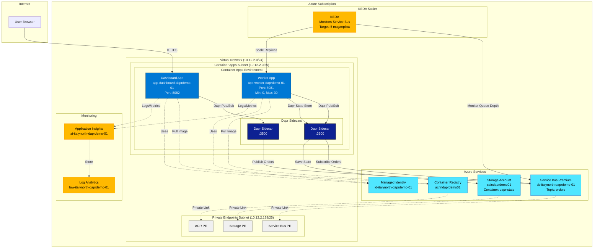

# Architecture Documentation

## System Architecture

This document describes the architecture of the Dapr-based autoscaling demo on Azure Container Apps.

## High-Level Architecture Diagram



## Component Details

### Container Apps

#### Dashboard App
- **Name**: `app-dashboard-daprdemo-01`
- **Image**: `acrindaprdemo01.azurecr.io/dashboard:latest`
- **Port**: 8082
- **Dapr App ID**: `dashboard`
- **Ingress**: External (HTTPS)
- **Scaling**: HTTP-based (1-3 replicas)
- **Function**: 
  - Web UI for generating orders
  - Publishes orders to Service Bus via Dapr
  - Displays metrics (queue depth, worker replicas)

#### Worker App
- **Name**: `app-worker-daprdemo-01`
- **Image**: `acrindaprdemo01.azurecr.io/worker:latest`
- **Port**: 8081
- **Dapr App ID**: `worker`
- **Ingress**: None (internal only)
- **Scaling**: KEDA-based (0-30 replicas)
- **Scaling Trigger**: Service Bus topic subscription
- **Target**: 5 messages per replica
- **Function**:
  - Subscribes to orders from Service Bus via Dapr
  - Processes orders
  - Saves state to Azure Storage via Dapr

### Dapr Components

#### Pub/Sub Component
- **Type**: `pubsub.azure.servicebus.topics`
- **Name**: `pubsub`
- **Backend**: Azure Service Bus Premium
- **Authentication**: Managed Identity (Workload Identity)
- **Topic**: `orders`
- **Subscription**: `worker` (auto-created by Dapr)
- **Scopes**: `dashboard`, `worker`

#### State Store Component
- **Type**: `state.azure.blobstorage`
- **Name**: `statestore`
- **Backend**: Azure Storage Account (Blob)
- **Authentication**: Managed Identity
- **Container**: `dapr-state`
- **Scopes**: `worker`

### KEDA Autoscaling

#### Configuration
```yaml
Scaler: azure-servicebus
Type: Topic Subscription
Topic: orders
Subscription: worker
Target: 5 messages per replica
Min Replicas: 0 (scale to zero)
Max Replicas: 30
Polling Interval: 2 seconds
Cooldown Period: 10 seconds
Authentication: System Identity
```

#### Scaling Behavior
- **Scale Up**: When messages in queue > 5 × current replicas
- **Scale Down**: After cooldown period when queue depth decreases
- **Scale to Zero**: When no messages for cooldown period

### Network Architecture

#### Virtual Network
- **Name**: `vnet-italynorth-daprdemo-01`
- **Address Space**: `10.12.2.0/24` (256 addresses)

#### Subnets
1. **Container Apps Subnet**
   - **CIDR**: `10.12.2.0/25` (128 addresses)
   - **Purpose**: Container Apps infrastructure
   - **Delegation**: `Microsoft.App/environments`

2. **Private Endpoints Subnet**
   - **CIDR**: `10.12.2.128/25` (128 addresses)
   - **Purpose**: Private endpoints for Azure services

#### Private DNS Zones
- `privatelink.azurecr.io` - Container Registry
- `privatelink.blob.core.windows.net` - Storage Account
- `privatelink.servicebus.windows.net` - Service Bus
- `privatelink.eventgrid.azure.net` - Event Grid (reserved)

### Security & Identity

#### Managed Identity
- **Name**: `id-italynorth-daprdemo-01`
- **Type**: User-Assigned Managed Identity
- **Used By**: Dashboard App, Worker App

#### RBAC Role Assignments
- **Storage Blob Data Contributor** → Storage Account
- **Azure Service Bus Data Owner** → Service Bus Namespace
- **AcrPull** → Container Registry

### Monitoring

#### Log Analytics Workspace
- **Name**: `law-italynorth-daprdemo-01`
- **Purpose**: Centralized logging for all Container Apps
- **Retention**: 30 days (default)

#### Application Insights
- **Name**: `ai-italynorth-daprdemo-01`
- **Purpose**: Application monitoring, metrics, traces
- **Integration**: Dapr telemetry enabled

## Data Flow

### Order Creation Flow

```
1. User clicks "10,000 Orders" in Dashboard UI
2. Dashboard app generates 10,000 order JSON objects
3. Dashboard publishes each order to Dapr pubsub (localhost:3500)
4. Dapr sidecar sends orders to Service Bus topic "orders"
5. Service Bus queues orders in "worker" subscription
```

### Order Processing Flow

```
1. KEDA monitors Service Bus subscription "worker"
2. KEDA scales Worker replicas based on queue depth
3. Each Worker instance subscribes via Dapr
4. Dapr delivers orders to Worker app (localhost:8081)
5. Worker processes order (simulated delay)
6. Worker saves state to Dapr statestore
7. Dapr sidecar persists state to Azure Blob Storage
8. Order is marked complete and removed from queue
```

### Scaling Behavior Example

```
Queue Depth: 150 messages
Target: 5 messages/replica
Desired Replicas: 150 / 5 = 30 replicas
Actual Replicas: 30 (capped at max)

Queue Depth: 25 messages
Target: 5 messages/replica
Desired Replicas: 25 / 5 = 5 replicas
Actual Replicas: 5

Queue Depth: 0 messages
Wait: 10 seconds cooldown
Actual Replicas: 0 (scale to zero)
```

## Infrastructure as Code

All infrastructure is defined in Bicep templates under `/infra`:

- **main.bicep** - Main orchestration template
- **modules/network.bicep** - VNet, subnets, private DNS zones
- **modules/storage.bicep** - Storage account with private endpoint
- **modules/servicebus.bicep** - Service Bus with private endpoint
- **modules/container-registry.bicep** - ACR with private endpoint
- **modules/managed-identity.bicep** - Managed identity with RBAC
- **modules/monitoring.bicep** - Log Analytics and App Insights
- **modules/container-environment.bicep** - Container Apps Environment + Dapr components
- **modules/container-app.bicep** - Dashboard app with HTTP scaling
- **modules/container-app-worker.bicep** - Worker app with KEDA scaling

## API Versions (as of December 2025)

- Container Apps: `2025-07-01`
- Container Apps Environments: `2025-07-01`
- Virtual Networks: `2025-01-01`
- Private Endpoints: `2025-01-01`
- Private DNS Zones: `2024-06-01`
- Storage Accounts: `2025-06-01`
- Service Bus: `2024-01-01`
- Container Registry: `2025-11-01`
- Managed Identity: `2024-11-30`
- Role Assignments: `2022-04-01`
- Log Analytics: `2025-07-01`
- Application Insights: `2020-02-02`
- Event Grid: `2025-02-15`
- Resource Groups: `2024-03-01`

## Deployment

See [README.md](../README.md) for deployment instructions.
